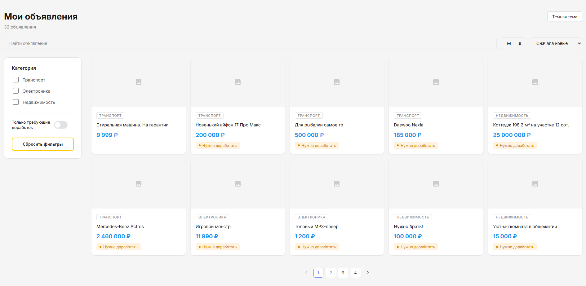
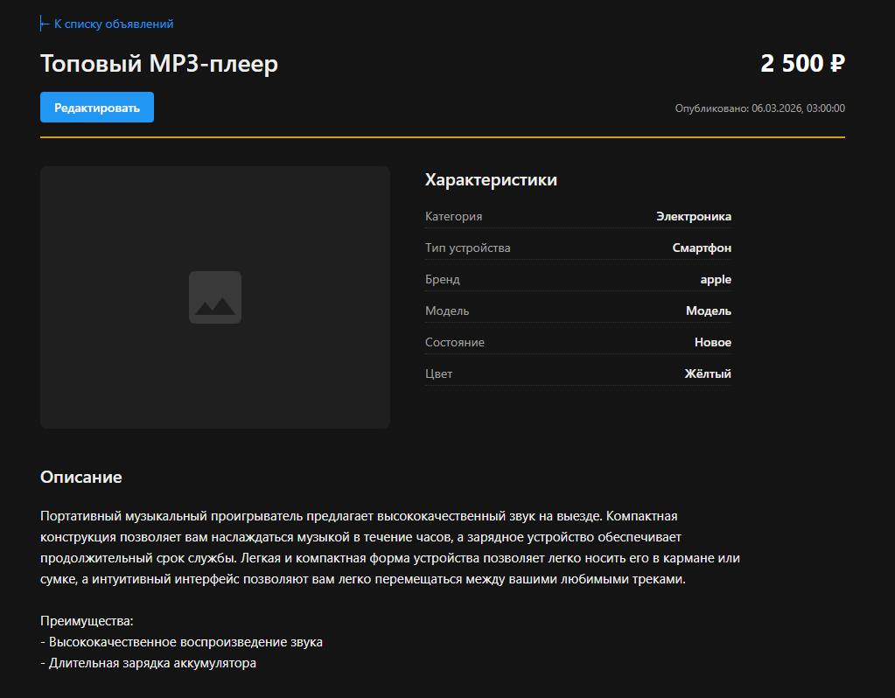
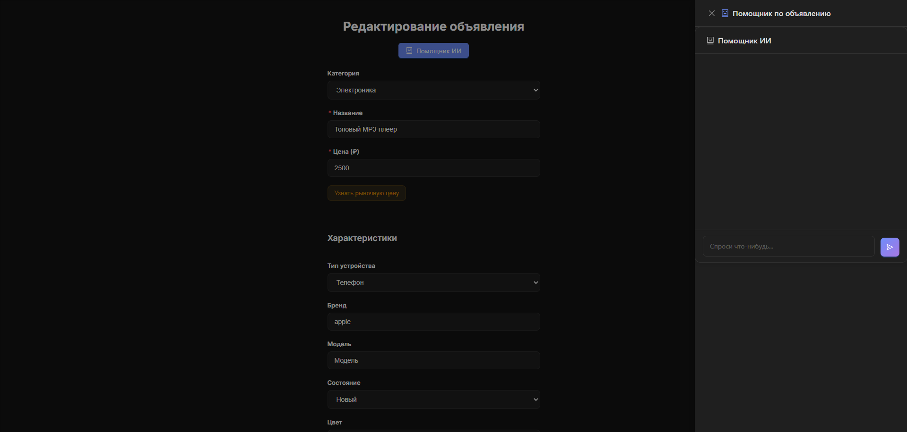
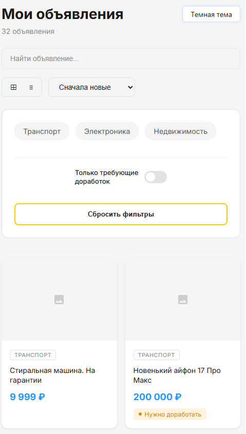

# AI-Ассистент продавца Авито

**Тестовое задание для стажёра Frontend (весенняя волна 2026)**

Интеллектуальный личный кабинет, помогающий продавцам улучшать качество объявлений. Система анализирует данные, предлагает оптимальную цену, генерирует продающие описания и предоставляет консультации через встроенный чат.

## Скриншоты приложения

| Список объявлений (Светлая тема) | Карточка товара (Тёмная тема) |
|:---:|:---:|
|  |  |

| Редактирование и AI-чат | Мобильная адаптация |
|:---:|:---:|
|  |  |

---

## Технологический стек

* **Frontend:** React, TypeScript.
* **Система сборки:** Vite.
* **State Management:** RTK Query (для эффективной работы с API и кеширования).
* **UI Library:** Ant Design (AntD).
* **Styling:** SCSS (BEM), AntD Design Token (для динамической смены тем).
* **Backend:** Node.js (Express) — основной сервер + выделенный сервер для AI-функций.
* **Virtualization:** Docker, Docker Compose.

---

## Ключевые особенности

### Интеграция с LLM (Llama 3)
Для работы AI реализован отдельный прокси-сервер на Node.js, который обрабатывает запросы к локальной модели Ollama. Это обеспечивает безопасность системных промптов и гибкую обработку данных.
* **Улучшение описания:** Автоматическое форматирование текста, удаление нецензурной лексики и структурирование преимуществ товара.
* **Оценка цены:** Анализ названия и характеристик товара для выдачи рекомендаций по стоимости.
* **Контекстный AI-чат:** Помощник на странице редактирования, который понимает текущие параметры товара и подсказывает, как правильно заполнить характеристики (мощность двигателя, площадь, состояние электроники и т.д.).

### Интерфейс и UX
* **Тёмная тема:** Полноценная поддержка темной темы через ConfigProvider от Ant Design. Выбор пользователя сохраняется в `localStorage`.
* **Адаптивная верстка:** Интерфейс полностью оптимизирован под мобильные устройства, планшеты и десктопы.
* **Валидация:** Автоматический поиск незаполненных полей с выводом списка необходимых доработок.
* **Persistence:** Состояние формы редактирования сохраняется в `localStorage`, что предотвращает потерю данных при перезагрузке страницы.

---

## Запуск проекта

Для работы AI-функций необходимо установить [Ollama](https://ollama.com/) и скачать модель командой `ollama pull llama3`.

### Способ 1: Docker Compose (Рекомендуемый)
Команда поднимет клиент, основной бэкенд и AI-сервис:
```bash
docker-compose up --build -d
```
* Client: `http://localhost:3000`
* Backend API: `http://localhost:8080`
* AI Proxy: `http://localhost:3001`

### Способ 2: Локальный запуск
Проект настроен на максимально простой запуск. Из корневой директории:
1.  **Установка зависимостей:** `npm install`
2.  **Запуск:** `npm start` (команда запустит фронтенд на Vite и серверные части).

---

## План доработок 

1.  **Добавление новых объявлений:** Реализация формы создания товара с нуля.
2.  **Визуальный Diff:** Отображение сравнения текста «Было/Стало» при генерации описания нейросетью.
3.  **Загрузка изображений:** Замена плейсхолдеров на систему загрузки и предпросмотра реальных фото.
4.  **Unit-тесты:** Покрытие бизнес-логики и мапперов параметров тестами (Vitest).
5.  **Добавление категорий:** Добавить большее количство категорий чтобы покрыть больше типов товаров.
6.  **Улучшение кода:** Убрать дублирующийся код, сделать его более простым для доработок и изменений.

---

Мне очень понравился этот проект. В процессе выполнения я попробовал много новых инструментов и значительно укрепил знания по уже изученным технологиям. Работа с интеграцией LLM в привычный интерфейс личного кабинета была отличным опытом, позволившим взглянуть на UX под новым углом.

---
*Выполнено для прохождения тестового задания в Avito, весна 2026.*
*Автор: Замский Константин Борисович*
